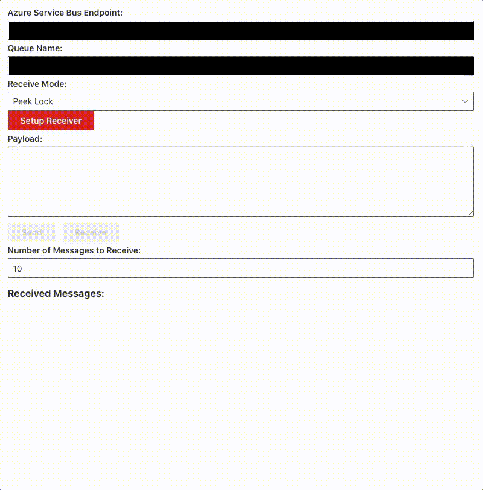

# react-azureservicebus

## Summary

This sample demonstrate how to use the `Azure Service Bus` directly from SPFx.
You can read and write messages using this sample.

## Compatibility

-Incompatible-red.svg "SharePoint Server 2016 Feature Pack 2 requires SPFx 1.1")

## Applies to

- [SharePoint Framework](https://aka.ms/spfx)
- [Microsoft 365 tenant](https://docs.microsoft.com/en-us/sharepoint/dev/spfx/set-up-your-developer-tenant)

> Get your own free development tenant by subscribing to [Microsoft 365 developer program](http://aka.ms/o365devprogram)

## Prerequisites

You will need an Azure Subscription in order to test or use the Azure Service Bus

## Version history

| Version | Date             | Comments        |
| ------- | ---------------- | --------------- |
| 1.0     | November 2024    | Initial release |

## Disclaimer

**THIS CODE IS PROVIDED _AS IS_ WITHOUT WARRANTY OF ANY KIND, EITHER EXPRESS OR IMPLIED, INCLUDING ANY IMPLIED WARRANTIES OF FITNESS FOR A PARTICULAR PURPOSE, MERCHANTABILITY, OR NON-INFRINGEMENT.**

---

## Minimal Path to Awesome

- Clone this repository
- Ensure that you are at the solution folder
- in the command-line run:
  - **npm install**
  - **gulp serve --nobrowser**

